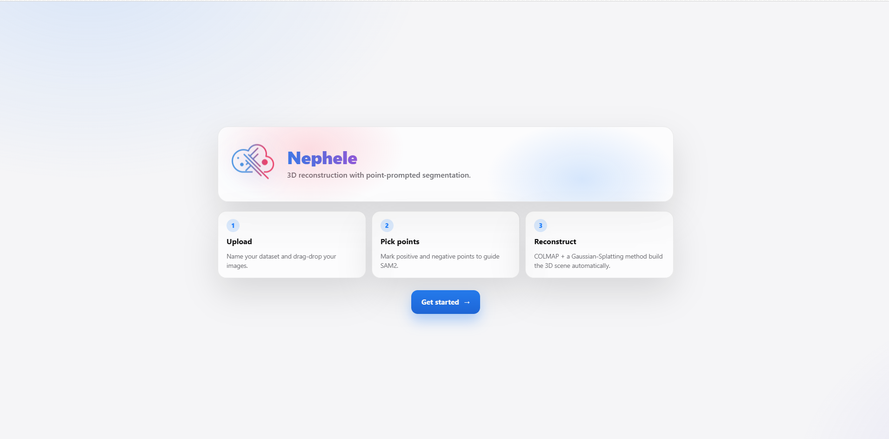
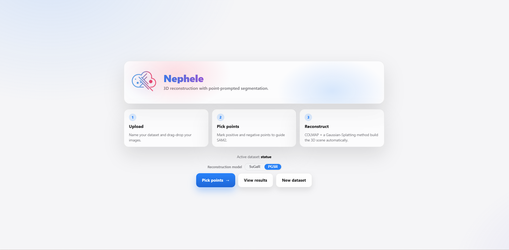
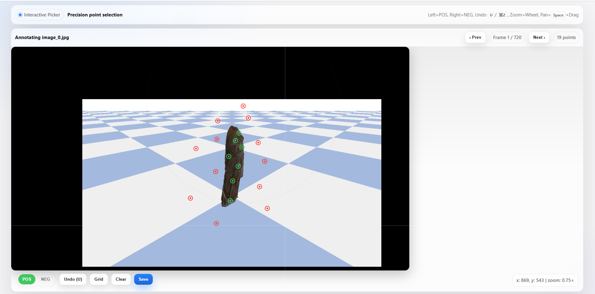
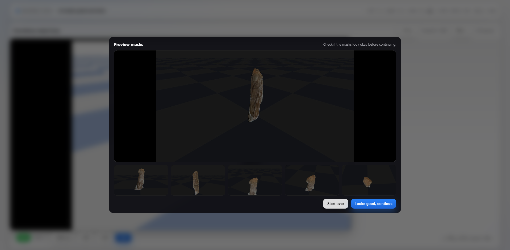
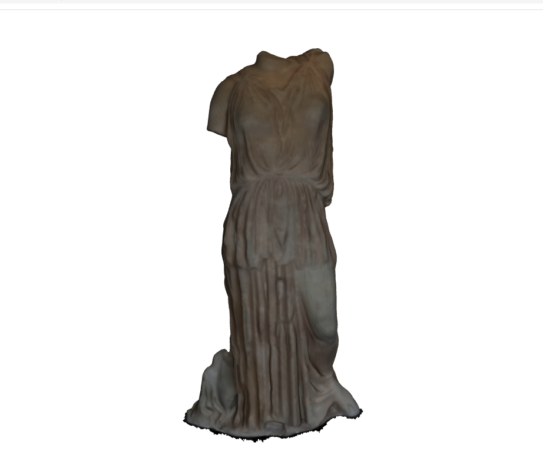

# Web UI (nefele_ui)

The `nefele_ui` branch provides a browser-based interface for the full NEPHELE pipeline.  
Instead of using the terminal, you upload images (or video), annotate in the browser, and download the final `.obj` mesh — all from a single web page.

The UI requires the **backend services to be running** (see [Running the Pipeline](run_pipeline.md)). Both the backend and UI must share the same filesystem path (configured via `SAMPLIFY_ROOT` in the UI `.env`).

---

## 1. Start the UI

From inside the `SAMplify_SuGaR_ui/nefele_ui` folder:

```bash
docker compose up --build -d
```

The first run builds the image, which takes a minute. Subsequent starts are faster:

```bash
docker compose up -d
```

To stop the UI:

```bash
docker compose down
```

---

## 2. Open the Browser

Navigate to:

```
http://localhost:8092
```

If you changed `WEB_PORT` in the `.env`, use that port instead.



---

## 3. Workflow

The UI guides you through five steps:

### Step 1 — Upload Data

You can provide data in three ways:

- **Upload images** — select `.jpg` files from your computer
- **Upload a video** — frames are extracted automatically
- **Load from HESTIA** — import an existing dataset from the HESTIA platform (requires `HESTIA_API_KEY`)

### Step 2 — Select a Model

Choose the reconstruction model:



| Model | Best for |
|-------|---------|
| **SuGaR** | General-purpose objects, varied shapes |
| **PGSR** | Textiles, garments, flat or thin surfaces |

### Step 3 — Annotate Points

An interactive image viewer opens. Click on the image to tell SAM2 what to keep and what to remove:



| Action | Meaning |
|--------|---------|
| **Left-click** | Foreground — the object to reconstruct |
| **Right-click** | Background — areas to exclude |

Add 3–7 foreground points on the object and a few background points on any distracting areas.  
Use the mouse wheel to zoom and **Space + drag** to pan.

Click **Save** when done.

### Step 4 — Review the Mask

SAM2 generates a mask preview from your points. Check that:



- The object is fully covered
- The background is cleanly removed
- Edges follow the object correctly

If the mask looks wrong, click **Start over** to re-annotate. If it looks good, click **Looks good, continue**.

### Step 5 — Download the Result

When reconstruction finishes, the UI shows a download button for the final `.obj` file.



---

## 4. Tips for Better Masks

- Add 3–7 foreground points spread across the object
- Add background points on shadows, reflections, or clutter near the edges
- Zoom into edges to place points more accurately
- Check a few frames with unusual angles or lighting before saving
- If the mask is off on specific frames, click **Start over** and add corrective points

## 5. Troubleshooting

**UI does not open**  
Check that the container is running:
```bash
docker compose ps
```
Then try `http://127.0.0.1:8092` instead.

**"Cannot connect to worker" error**  
Make sure `SAMPLIFY_ROOT` in the UI `.env` points to the correct `nefele-training` directory and that the backend services (`sam2`, `colmap`, `sugar` or `pgsr`) are running.

**Mask quality is poor**  
Add more points — especially background points around difficult edges (shadows, reflections).
