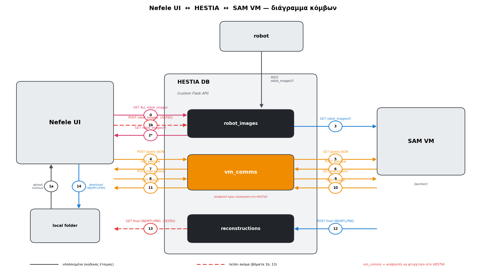

# NEPHELE Documentation

<p align="center">
    
</p>

**NEPHELE** is a pipeline for background-free 3D mesh reconstruction, developed within the [TEXTaiLES](https://www.echoes-eccch.eu/textailes/) toolbox at Athena Research Center.

It combines three components in sequence:

| Step | Component | What it does |
|------|-----------|-------------|
| 1 | **SAM2** | Segments the object from the background using interactive point annotation |
| 2 | **COLMAP** | Estimates camera positions and builds a sparse 3D point cloud |
| 3 | **SuGaR / PGSR** | Optimizes a Gaussian field and extracts a clean `.obj` mesh |

The result is a textured 3D mesh with no background — ready for use in downstream applications.

---

## Two components, two branches

NEPHELE is split across two branches of the same repository:

| Branch | Role | Use it when |
|--------|------|-------------|
| [`nefele-training`](https://github.com/TEXTaiLES/SAMplify_SuGaR/tree/nefele-training) | Backend — SAM2, COLMAP, SuGaR/PGSR run as Docker containers | You want to run the pipeline from the terminal |
| [`nefele_ui`](https://github.com/TEXTaiLES/SAMplify_SuGaR/tree/nefele_ui) | Web UI — browser-based interface for upload, annotation, and download | You want a visual interface without touching the terminal |

Both can run together: the UI communicates with the backend over a shared filesystem or through the HESTIA API.

---

## Architecture

<p align="center">
    
</p>

In the full deployment, **Nefele UI** and the **SAM VM** (backend) communicate through **HESTIA** — a central API that manages image jobs, reconstruction state, and results. For local use, the two components share a filesystem directly without HESTIA.

---

## Where to start

→ **[Installation](deployment/installation_basic.md)** — clone the branches, install requirements, build Docker images

---

## Citation

If you use this software, please cite it using the following BibTeX entry:

```bibtex
@software{Nephele_TEXTaiLES_2026,
  author  = {{Athena Research Center}},
  title   = {{Nephele: SAM2 + COLMAP + SuGaR pipeline for background-free 3D mesh reconstruction}},
  url     = {https://github.com/TEXTaiLES/SAMplify_SuGaR},
  version = {0.1.0},
  year    = {2025},
  license = {MIT}
}
```

## Third-party citations

```bibtex
@article{ravi2024sam2,
  title={SAM 2: Segment Anything in Images and Videos},
  author={Ravi, Nikhila and Gabeur, Valentin and Hu, Yuan-Ting and Hu, Ronghang and Ryali, Chaitanya and Ma, Tengyu and Khedr, Haitham and R{\"a}dle, Roman and Rolland, Chloe and Gustafson, Laura and Mintun, Eric and Pan, Junting and Alwala, Kalyan Vasudev and Carion, Nicolas and Wu, Chao-Yuan and Girshick, Ross and Doll{\'a}r, Piotr and Feichtenhofer, Christoph},
  journal={arXiv preprint arXiv:2408.00714},
  url={https://arxiv.org/abs/2408.00714},
  year={2024}
}

@inproceedings{Schonberger2016SfM,
  title     = {Structure-from-Motion Revisited},
  author    = {Sch{\"o}nberger, Johannes L. and Frahm, Jan-Michael},
  booktitle = {Proceedings of the IEEE Conference on Computer Vision and Pattern Recognition (CVPR)},
  year      = {2016}
}

@article{guedon2023sugar,
  title   = {SuGaR: Surface-Aligned Gaussian Splatting for Efficient 3D Mesh Reconstruction and High-Quality Mesh Rendering},
  author  = {Gu{\'e}don, Antoine and Lepetit, Vincent},
  journal = {CVPR},
  year    = {2024}
}

@article{kerbl2023gaussiansplatting,
  title   = {3D Gaussian Splatting for Real-Time Radiance Field Rendering},
  author  = {Kerbl, Bernhard and Kopanas, Georgios and Leimk{\"u}hler, Thomas and Drettakis, George},
  journal = {ACM Transactions on Graphics},
  year    = {2023}
}
```

## License

This project is licensed under the MIT License.

<p align="center">
    
</p>
