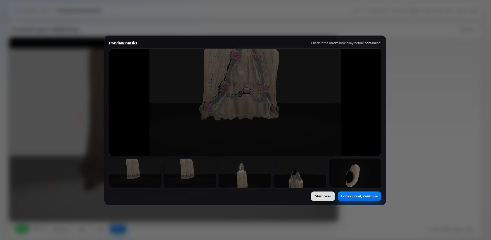
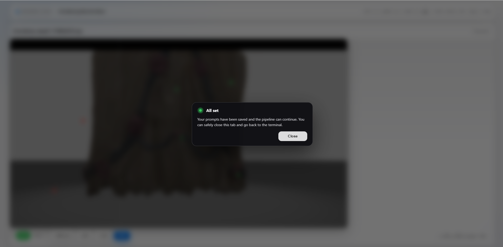

# SAM2 Manual — Interactive Point Picker

The SAM2 module handles the segmentation step of the pipeline.  
When you run the full pipeline using:

```

./run_pipeline.sh <dataset_name>

```

SAM2 automatically launches a **browser-based interface** on:

```

[http://localhost:8092](http://localhost:8092)

```

This interface allows you to annotate the dataset using **interactive point picking**.
It is the only step where the user provides manual input.

## 1. Point Picker Interface Overview

When the interface opens, you will see a screen like the one below:


- Inspect each frame of your dataset  
- Add **foreground points** on the object  
- Add **background points** on unwanted regions  
- Save the prompts (`prompts.json`) used for mask generation  

SAM2 supports two modes, but the pipeline uses:

** Interactive Picker (recommended)**


## 2. First-Time Use

When processing a dataset **for the first time**, the following files do *not* exist yet:

```

SAM2/data/output/<dataset_name>/prompts.json
SAM2/data/output/<dataset_name>/__picker_done.flag

```

So SAM2 will only show:

### **Create new**

This means you must annotate the dataset manually:

1. Click inside the image to add **foreground** points  
2. Add **background** points to remove clutter  
3. Repeat for all images  
4. Click “Save” at the end  

SAM2 will automatically generate:

```

SAM2/data/output/<dataset_name>/prompts.json
SAM2/data/output/<dataset_name>/__picker_done.flag

```

These files store your segmentation instructions.


## 2.1 Annotating New Points (Foreground / Background)

If you choose **Create new**, SAM2 will guide you through the full manual annotation process.
You will first see the annotation interface:


Here you can click on the image and define which areas belong to the object (foreground)
and which belong to the background.

### 🟢 Foreground vs 🔴 Background Points

SAM2 uses two types of points:

| Click | Color | Meaning |
|-------|--------|---------|
| **Left click** | 🟢 Green | Foreground (object to keep) |
| **Right click** | 🔴 Red | Background (remove this area) |

Example:


- Use **right-click** to add **green points** on the object  
- Use **right-click** to add **red points** on background or areas to exclude  
- Use the mouse wheel to zoom  
- Hold **Space + Drag** to pan  
- Press **U** or click **Undo** to remove the last point  

Once you've placed your points, click **Save**. SAM2 will generate a mask preview.


###  Preview Generation

After clicking *Save*, the system shows:


This stage computes the segmentation based on the points you provided.


###  Reviewing Several Masked Frames

SAM2 then displays a gallery of sample frames with masks applied:



Here you should check:

- If the mask correctly follows the object  
- If important details are preserved  
- If background is eliminated properly  
- If the mask quality is acceptable across multiple frames  

If the result is **not good**, click **Start over** and refine your points.

If the result looks correct, click **Looks good, continue**.


###  Final Confirmation

Once the masks are accepted, SAM2 displays a confirmation message:



At this point:

- Your prompts have been saved  
- The `prompts.json` and `__picker_done.flag` files are created  
- The pipeline continues automatically (COLMAP starts next)  

You can safely close the browser tab and return to the terminal.


## 3. Using Existing Prompts (Second Run)

If a previous annotation exists, the picker will *detect* these files:

```

prompts.json
__picker_done.flag

```

Then the interface will show two buttons:

### Use existing
Loads your saved points automatically.

### Create new 
Starts annotation from scratch and overwrites the old prompts.

This allows you to redo segmentation only when needed, instead of repeating the entire process.


## 4. Files Created by SAM2

After annotation, SAM2 generates the following directory structure:

```

SAM2/data/output/<dataset_name>/
├── prompts.json
├── __picker_done.flag
├── __use_existing.flag          (created only if "Use existing" is selected)
├── masks/
└── masked_images/

```

### File Descriptions

| File | Purpose |
|------|---------|
| **prompts.json** | Stores all user clicks for segmentation |
| **__picker_done.flag** | Indicates that annotation is complete |
| **__use_existing.flag** | Indicates that old prompts should be reused |
| **masks/** | Binary masks generated from SAM2 |
| **masked_images/** | Images multiplied by the mask, used by COLMAP |


## 5. What Happens After Point Picking

Once the annotation step is done:

1. SAM2 generates masks  
2. SAM2 generates masked images  
3. The pipeline **automatically continues** to COLMAP  

You do not need to run anything manually.


## 6. Tips for Best Mask Quality

- Add 3–7 foreground points on the object  
- Add background points for shadows, reflections, or clutter  
- Zoom into edges to improve accuracy  
- Check frames with different lighting or unusual angles  
- Make sure the object is not clipped by the mask  

Even a few accurate prompts dramatically improve reconstruction quality.


## 7. Troubleshooting

### ❗ The GUI does not open
Try manually visiting:

```

[http://127.0.0.1:8092](http://127.0.0.1:8092)

```

If it still fails:

- Check that no other app uses port 8092  
- Restart the pipeline  
- Clear browser cache  

### ❗ Masks look incorrect
- Select **Create new** and re-annotate  
- Add more foreground/background points  
- Focus on difficult frames (shiny, dark, motion blur)  


## 8. Summary

The SAM2 Interactive Picker is the **only manual step** of the pipeline.  
Once annotation is complete, the rest of the reconstruction process is fully automatic.

You are now ready to proceed to:

 **COLMAP Manual**  
 **SuGaR Optimization Manual**


